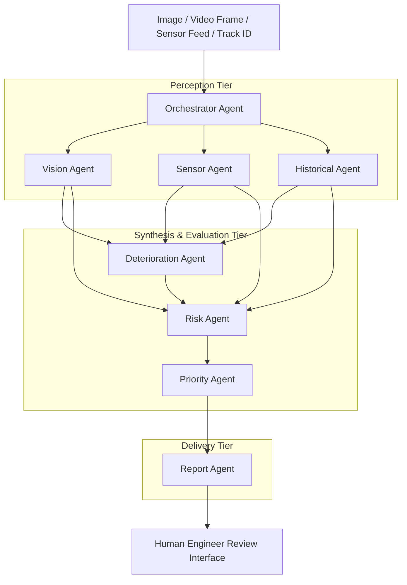

# RailGuard AI — Multi-Agent AI Architecture Specification

---

## 1. Multi-Agent Philosophy

RailGuard AI adopts an **explainable, modular multi-agent architecture**. Rather than treating AI as an opaque monolithic black box, specialized autonomous agents collaborate in an orchestrated DAG (Directed Acyclic Graph) to evaluate distinct aspects of railway safety.

---

## 2. Agent Catalog & Specifications

### 1. Vision Agent (`VisionAgent`)
* **Purpose**: Inspects visual media for surface defects, fastener abnormalities, ballast scouring, and joint misalignment.
* **Input**: RGB Image / Video Frame array, track section code.
* **Processing**: OpenCV edge analysis, adaptive thresholding, contour extraction, localized patch feature classification, and bounding box coordinate mapping.
* **Output**: `anomaly_type`, `bounding_box: {x, y, width, height}`, `confidence: [0.0 - 1.0]`, `annotated_evidence_url`, `visual_explanation`.
* **Failure Handling**: Fallback to raw edge detection baseline if high-level classifier is ambiguous.

### 2. Sensor Agent (`SensorAgent`)
* **Purpose**: Evaluates continuous telemetry against calibrated physical baselines.
* **Input**: Vibration RMS ($m/s^2$), rail surface temperature ($^\circ\text{C}$), dynamic track stress (MPa), axle loading (tonnes), acoustic emissions (dB).
* **Processing**: Multi-variate z-score anomaly detection, thermal differential analysis, load-stress correlation.
* **Output**: `vibration_deviation_pct`, `temperature_flag`, `stress_anomaly_detected`, `sensor_health_score`.

### 3. Historical Agent (`HistoricalAgent`)
* **Purpose**: Retrieves prior inspection logs, historical defect growth rates, and repair track records.
* **Input**: Track Section ID, current defect classification.
* **Processing**: Time-series progression tracking, defect size delta calculation ($\Delta L$, $\Delta W$), repeat occurrence count.
* **Output**: `previous_inspection_date`, `previous_defect_size_mm`, `growth_percentage`, `prior_engineer_notes`.

### 4. Deterioration Agent (`DeteriorationAgent`)
* **Purpose**: Computes the composite Deterioration Index (0-100) combining visual, sensory, historical, and elapsed-cycle metrics.
* **Input**: Outputs from Vision, Sensor, and Historical agents + Track age.
* **Processing**: Weighted composite score formula:
  $$DI = 0.35 \cdot V + 0.25 \cdot S + 0.25 \cdot H + 0.15 \cdot R$$
* **Output**: `deterioration_score` (0-100), `health_status` (`HEALTHY`, `NORMAL`, `WATCH`, `HIGH`, `CRITICAL`), `primary_driver`.

### 5. Risk Agent (`RiskAgent`)
* **Purpose**: Synthesizes multi-source evidence into an auditable risk evaluation.
* **Input**: Consolidated evidence vector from Vision, Sensor, Historical, and Deterioration agents.
* **Processing**: Rule-based & probabilistic decision matrix factoring operational line speed and passenger/freight tonnage.
* **Output**: `risk_level` (`LOW`, `MEDIUM`, `HIGH`, `CRITICAL`), `confidence_bracket`, `evidence_summary_bullets`.

### 6. Priority Agent (`PriorityAgent`)
* **Purpose**: Determines human inspection triage priority and recommended maintenance timelines.
* **Input**: Risk evaluation, line criticality, upcoming train schedules.
* **Processing**: Triage engine assigning SLA (e.g. Critical = 6-hour window, High = 48-hour window, Medium = 14-day window).
* **Output**: `priority` (`CRITICAL`, `HIGH`, `MEDIUM`, `LOW`), `recommended_action`, `dispatch_sla_hours`.

### 7. Report Agent (`ReportAgent`)
* **Purpose**: Synthesizes technical inspection dossiers with auditable separation of AI findings vs engineer decisions.
* **Input**: Complete inspection run data, engineer review inputs, audit timestamps.
* **Processing**: Natural language summarization and executive report structure generation.
* **Output**: Structured executive summary, compliance matrix, formatted printable dossier.

### 8. Orchestrator Agent (`OrchestratorAgent`)
* **Purpose**: Coordinates the DAG pipeline execution, validates inter-agent message payloads, enforces timeouts, and logs execution latency.
