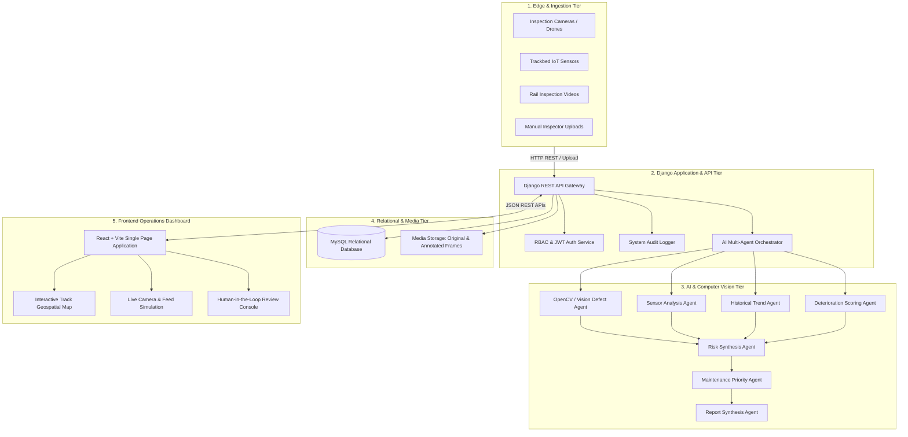
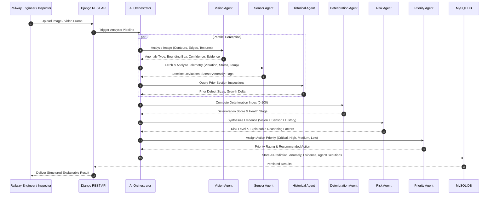
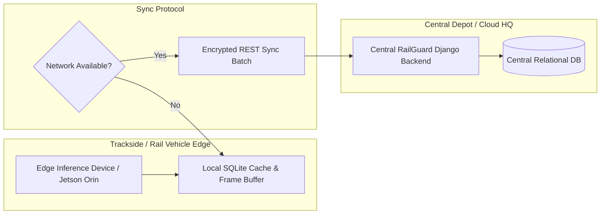

# RailGuard AI — System Architecture & Design Specification

> **Inspect Smarter. Predict Earlier. Maintain Safer.**

---

## 1. System Overview

**RailGuard AI** is an enterprise-grade railway infrastructure inspection and predictive maintenance platform designed to support human railway engineers with explainable artificial intelligence.

The system combines computer vision defect localization, real-time sensor deviation monitoring, multi-agent reasoning, historical wear progression analysis, and risk-weighted prioritization. Every AI finding is treated as an advisory signal with explicit supporting evidence, confidence metrics, and an engineer review requirement before maintenance work orders are sanctioned.

---

## 2. Multi-Agent AI Orchestration Architecture

RailGuard AI implements an 8-agent modular pipeline where individual specialized agents analyze specific modalities and feed their structured findings into higher-order risk and decision agents.

---

## 3. Deterioration Scoring Engine

The platform calculates a composite **Deterioration Index ($DI \in [0, 100]$)** for every track segment based on weighted multi-source parameters:

$$DI = w_v \cdot V + w_s \cdot S + w_h \cdot H + w_r \cdot R$$

Where:
* **$V$ (Visual Severity Factor, 35%)**: Extracted defect dimensions, crack length/depth ratio, or surface spalling severity.
* **$S$ (Sensor Deviation Factor, 25%)**: Root-mean-square vibration deviation and thermal/stress delta above baseline.
* **$H$ (Historical Progression Factor, 25%)**: Percentage growth rate of structural abnormalities over the last 3-5 inspections.
* **$R$ (Recency & Age Factor, 15%)**: Elapsed operational cycles and days since last full maintenance rehabilitation.

### Index Categorization:
* `0 - 24`: **Healthy** (Standard monitoring cycle)
* `25 - 49`: **Normal Wear** (Scheduled routine track patrol)
* `50 - 74`: **Watch / Elevated** (Shortened inspection frequency recommended)
* `75 - 89`: **High Priority** (Engineering review and physical verification scheduled)
* `90 - 100`: **Critical** (Immediate track speed restriction / emergency repair workflow)

---

## 4. Role-Based Access Control (RBAC)

The system enforces strict permission boundaries both in the Django REST backend viewsets and the React client routing:

| Role | Dashboard | Upload & Run AI | Live Camera | Engineer Review | Generate Reports | User Admin | Audit Logs |
| :--- | :---: | :---: | :---: | :---: | :---: | :---: | :---: |
| **Admin** | Full | Full | Full | Full | Full | Full | Full |
| **Railway Engineer** | Full | Full | Full | Full (Approve/Reject) | Full | Read-Only | Read-Only |
| **Inspector** | Full | Full | Full | View Only | View Only | None | None |
| **Maintenance Team** | Operational | Read-Only | View Only | View Only | View Only | None | None |
| **Viewer / Auditor** | Read-Only | None | View Only | None | View Only | None | Read-Only |

---

## 5. Offline & Edge Computing Concept

To address remote track corridors with intermittent cellular coverage, RailGuard AI is architected with a dual-tier edge synchronization protocol:

---

## 6. Auditability and Regulatory Compliance

In adherence with railway safety management protocols (e.g. EN 50126 / FRA standards):
1. **Zero Black-Box Assertions**: Every prediction must be accompanied by visual coordinates, pixel-level defect contours, and timestamped sensor corroboration.
2. **Mandatory Human Signature**: No track work order is sanctioned solely on automated inference. An accredited railway engineer must submit an auditable `EngineerReview` record.
3. **Immutable Audit Trails**: Every login, model inference, review submission, and configuration change writes an append-only `AuditLog` entry storing actor, timestamp, client IP, action type, and diff state.
