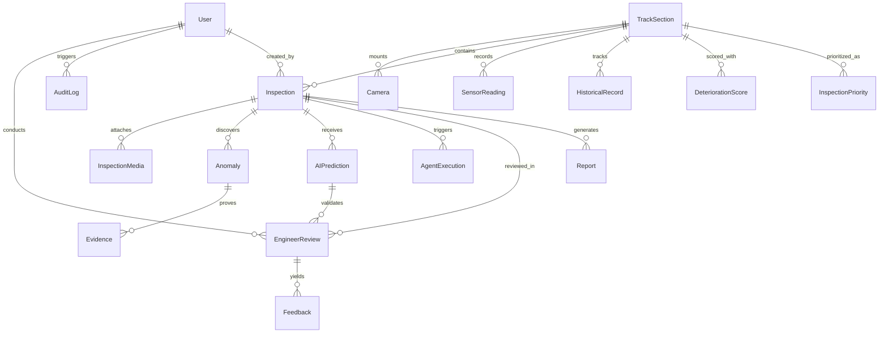

# RailGuard AI — Database Schema & Entity Relationship

---

## 1. Relational Database Design

The database schema is designed for MySQL (with SQLite compatibility for rapid zero-dependency local runs). It stores geospatial track infrastructure, inspection logs, raw/annotated imagery, AI detections, multi-agent execution runs, telemetry streams, and immutable engineer reviews.

---

## 2. Table Specifications

### 2.1 `accounts_user`
| Column | Type | Description |
| :--- | :--- | :--- |
| `id` | BigAutoField | Primary Key |
| `username` | VarChar(150) | Unique username |
| `email` | VarChar(254) | User email |
| `role` | VarChar(20) | `ADMIN`, `ENGINEER`, `INSPECTOR`, `MAINTENANCE`, `VIEWER` |
| `badge_id` | VarChar(50) | Railway certification / employee badge ID |
| `department` | VarChar(100) | Department (e.g. Track Infrastructure, Signaling) |
| `is_active` | Boolean | Account status |
| `date_joined` | DateTime | Creation timestamp |

### 2.2 `core_tracksection`
| Column | Type | Description |
| :--- | :--- | :--- |
| `id` | BigAutoField | Primary Key |
| `section_code` | VarChar(30) | Unique Section Code (e.g. `TRK-014`) |
| `name` | VarChar(150) | Track name / Corridor descriptor |
| `line_type` | VarChar(50) | `MAIN_LINE`, `HIGH_SPEED`, `FREIGHT`, `YARD` |
| `start_km` | Decimal(8,3) | Start kilometer marker |
| `end_km` | Decimal(8,3) | End kilometer marker |
| `latitude` | Decimal(10,6) | Representative latitude |
| `longitude` | Decimal(10,6) | Representative longitude |
| `health_status`| VarChar(20) | `HEALTHY`, `NORMAL`, `WATCH`, `HIGH`, `CRITICAL` |
| `deterioration_score` | Integer | Calculated Deterioration Index (0-100) |
| `last_inspection_date` | Date | Date of most recent inspection |

### 2.3 `core_camera`
| Column | Type | Description |
| :--- | :--- | :--- |
| `id` | BigAutoField | Primary Key |
| `camera_code` | VarChar(30) | e.g. `CAM-014` |
| `track_section_id` | FK -> TrackSection | Associated track section |
| `location_description` | VarChar(255) | Overhead gantry / side sensor mount |
| `resolution` | VarChar(20) | e.g. `1080p`, `4K` |
| `stream_url` | VarChar(255) | RTSP or simulated video stream path |
| `is_active` | Boolean | Live / Offline status |
| `last_heartbeat` | DateTime | Last operational ping |

### 2.4 `inspections_inspection`
| Column | Type | Description |
| :--- | :--- | :--- |
| `id` | BigAutoField | Primary Key |
| `inspection_code` | VarChar(40) | Unique identifier (e.g. `INS-2026-0142`) |
| `track_section_id` | FK -> TrackSection | Target track section |
| `inspector_id` | FK -> User | Submitting inspector |
| `inspection_date`| DateTime | Time of inspection run |
| `source` | VarChar(30) | `DRONE`, `PATROL_TRAIN`, `FIXED_CAM`, `MANUAL` |
| `status` | VarChar(30) | `PROCESSING`, `AI_COMPLETE`, `AWAITING_REVIEW`, `REVIEWED`, `CLOSED` |
| `risk_level` | VarChar(20) | `LOW`, `MEDIUM`, `HIGH`, `CRITICAL` |
| `notes` | TextField | Operational notes |

### 2.5 `inspections_anomaly`
| Column | Type | Description |
| :--- | :--- | :--- |
| `id` | BigAutoField | Primary Key |
| `inspection_id` | FK -> Inspection | Parent inspection |
| `anomaly_type` | VarChar(50) | `Surface Crack`, `Rail Corrosion`, `Fastener Abnormality`, `Joint Abnormality`, etc. |
| `severity` | VarChar(20) | `LOW`, `MEDIUM`, `HIGH`, `CRITICAL` |
| `confidence` | Decimal(5,4) | Model confidence (0.0000 - 1.0000) |
| `bounding_box` | JSONField | Normalized `{x, y, width, height}` |
| `explanation` | TextField | Human-readable AI rationale |
| `confirmed_by_engineer` | Boolean | True if engineer approved finding |

### 2.6 `inspections_evidence`
| Column | Type | Description |
| :--- | :--- | :--- |
| `id` | BigAutoField | Primary Key |
| `anomaly_id` | FK -> Anomaly | Target anomaly |
| `original_image` | ImageField | Raw uploaded sensor / camera frame |
| `annotated_image`| ImageField | OpenCV annotated frame with bounding boxes & contours |
| `metadata` | JSONField | Resolution, camera settings, exposure |

### 2.7 `sensors_sensorreading`
| Column | Type | Description |
| :--- | :--- | :--- |
| `id` | BigAutoField | Primary Key |
| `track_section_id` | FK -> TrackSection | Track location |
| `timestamp` | DateTime | Reading timestamp |
| `vibration_rms` | Float | Root-mean-square vibration ($m/s^2$) |
| `rail_temperature`| Float | Rail temperature in $^\circ\text{C}$ |
| `track_stress` | Float | Mechanical stress (MPa) |
| `axle_load` | Float | Axle load (Metric Tonnes) |
| `humidity` | Float | Ambient humidity (%) |
| `acoustic_db` | Float | Ultrasonic/acoustic level (dB) |
| `is_simulated` | Boolean | Simulation tag (Always True for synthetic) |

### 2.8 `reviews_engineerreview` & `reviews_feedback`
| Column | Type | Description |
| :--- | :--- | :--- |
| `id` | BigAutoField | Primary Key |
| `inspection_id` | FK -> Inspection | Inspected asset |
| `engineer_id` | FK -> User | Reviewing licensed engineer |
| `decision` | VarChar(30) | `CONFIRM`, `REJECT`, `NEEDS_FURTHER_INSPECTION` |
| `engineering_comment` | TextField | Technical notes & maintenance prescription |
| `work_order_required` | Boolean | Whether maintenance team dispatch is required |
| `timestamp` | DateTime | Submission timestamp |

### 2.9 `reports_report`
| Column | Type | Description |
| :--- | :--- | :--- |
| `id` | BigAutoField | Primary Key |
| `report_code` | VarChar(40) | e.g. `REP-2026-0812` |
| `inspection_id` | FK -> Inspection | Associated inspection |
| `generated_by` | FK -> User | Generating user |
| `executive_summary` | TextField | Comprehensive synthetic briefing |
| `ai_vs_engineer_matrix` | JSONField | Comparison of AI proposals vs final decisions |
| `file_path` | FileField | Exported document |
| `created_at` | DateTime | Timestamp |

### 2.10 `audit_auditlog`
| Column | Type | Description |
| :--- | :--- | :--- |
| `id` | BigAutoField | Primary Key |
| `user_id` | FK -> User (nullable) | Actor |
| `action` | VarChar(80) | `LOGIN`, `UPLOAD_MEDIA`, `AI_ANALYSIS`, `ENGINEER_REVIEW`, `GENERATE_REPORT` |
| `target_model` | VarChar(50) | Affected entity table |
| `target_id` | VarChar(50) | Affected entity primary key |
| `ip_address` | GenericIPAddress | Request IP address |
| `details` | JSONField | Audit diff snapshot (before/after changes) |
| `timestamp` | DateTime | Timestamp |
