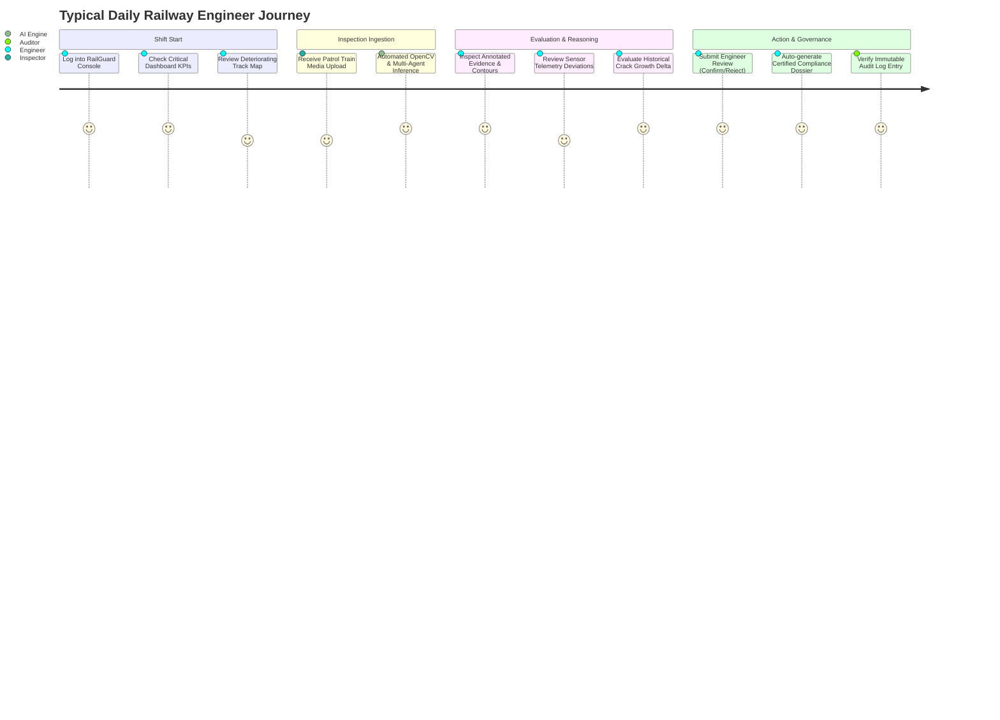

# RailGuard AI — User Guide & Operational Walkthrough

---

## 1. Introduction

**RailGuard AI** is structured around the core principle of **Human-Centered, Explainable AI**. Rather than automating away critical engineering decisions, RailGuard AI acts as an augmented intelligence copilot for railway safety teams.

---

## 2. Complete End-to-End User Journey

---

## 3. Key Operational Views

### 3.1 Main Operations Dashboard (`/dashboard`)
* Real-time metrics: Critical Issues, High Priority Inspections, Deteriorating Sections, Model Health.
* Multi-Agent live status card with response latency.
* Deterioration & Anomaly category distributions.

### 3.2 Live Camera & Simulation (`/inspections/live-camera`)
* Monitor simulated or connected RTSP trackside camera streams.
* Live bounding box overlays for detected rail surface defects with confidence percentages.
* Capture Frame and instant multi-agent breakdown.

### 3.3 Interactive Track Map (`/track-map`)
* Geospatial corridor visualization with health badges:
  - 🟢 **Healthy (0-24)**
  - 🟡 **Normal (25-49)**
  - 🟠 **Watch / Elevated (50-74)**
  - 🔴 **Critical (75-100)**
* Click any section to open side drawer with historical metrics and active defects.

### 3.4 Historical Image Comparison (`/historical`)
* Interactive side-by-side split slider comparing prior inspection photos with current inspection photos.
* Differential wear calculation and crack growth rate percentage.

### 3.5 Live Sensor Simulator (`/sensors`)
* Real-time charts for Vibration ($m/s^2$), Rail Temperature ($^\circ\text{C}$), Track Stress (MPa), and Axle Load (Tonnes).
* Controls: **Start Simulation**, **Stop Simulation**, **Inject Anomaly**, **Reset Baselines**.

### 3.6 Engineer Review & Governance (`/reviews`)
* Inspect AI findings alongside evidence bounding boxes and multi-agent reasoning logs.
* Action buttons: `CONFIRM`, `REJECT`, `NEEDS FURTHER INSPECTION`.
* Compulsory engineer technical commentary to enforce regulatory accountability.

### 3.7 Certified Report Generation (`/reports`)
* One-click generation of comprehensive PDF/Printable inspection reports clearly demarcating AI predictions from signed engineer findings.
